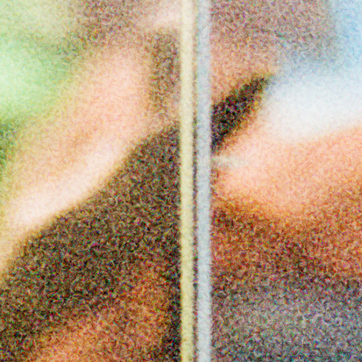

# larm

larm is a film grain/noise generator written in Rust.

# Examples

## 1

`./larm --size 8.0 --intensity 2.0 --sharpness 20.0 --shadow-grain 2.0 --midtone-grain 2.0 --highlight-grain 2.0 --depth 1.0 --chromatic 6.0 --relief 0.8 --layers 5`


### Cropped


## 2

`./larm --size 4.0 --intensity 1.4 --sharpness 12.0 --shadow-grain 1.6 --midtone-grain 1.2 --highlight-grain 0.6 --depth 0.7 --chromatic 3.5 --relief 0.5 --layers 4`


### Cropped



# Usage

## Command Line Arguments

| Flag                | Default      | Description                                                                                                                                                 |
|:--------------------|:-------------|:------------------------------------------------------------------------------------------------------------------------------------------------------------|
| `input`             | (Required)   | Path to the input image (e.g., `.jpg`, `.png`).                                                                                                             |
| `--output`, `-o`    | `output.png` | Path to save the processed image.                                                                                                                           |
| `--size`, `-s`      | `2.0`        | **Grain Size:** Controls the scale of the grain clumps. Larger values produce coarser, more visible "blobs."                                                |
| `--intensity`, `-i` | `0.8`        | **Overall Strength:** Multiplier for the grain opacity. Higher values make the grain more prominent.                                                        |
| `--sharpness`       | `8.0`        | **Crystal Sharpness:** Controls the contrast of individual grains. Low values look like soft "clouds"; high values look like distinct, hard-edged crystals. |
| `--exposure`, `-e`  | `0.0`        | **Exposure Adjustment:** Measured in "stops." `1.0` doubles brightness; `-1.0` halves it. Applied after grain for realistic highlight handling.             |
| `--saturation`      | `1.0`        | **Post-Process Saturation:** `0.0` creates a B&W image; `1.0` is original; `>1.0` makes the colors (and color grain) more vivid.                            |

## Tonal Control (Density Distribution)

*These flags allow you to replicate the behavior of different film stocks (e.g., negatives usually have more grain in
the highlights).*

| Flag                 | Default | Description                                                                         |
|:---------------------|:--------|:------------------------------------------------------------------------------------|
| `--shadow-grain`     | `1.2`   | Grain density multiplier in the shadows (0–25% brightness).                         |
| `--midtone-grain`    | `1.0`   | Grain density multiplier in the midtones (25–75% brightness).                       |
| `--highlight-grain`  | `0.6`   | Grain density multiplier in the highlights (75–100% brightness).                    |
| `--tonal-smoothness` | `0.15`  | Controls how "blurry" the boundaries are between shadows, midtones, and highlights. |

## 3D & Analog Emulation Physics

*These parameters control the 3D engine that simulates the physical properties of film emulsion.*

| Flag          | Default | Description                                                                                                                                                                                           |
|:--------------|:--------|:------------------------------------------------------------------------------------------------------------------------------------------------------------------------------------------------------|
| `--depth`     | `0.4`   | **Volumetric Depth:** Uses pixel luminance as the Z-axis in the 3D noise field. This ensures that a gradient (like a sky) has a physically different grain structure as it gets brighter.             |
| `--chromatic` | `2.0`   | **Chromatic Separation:** Simulates the layers of a color film negative. It adds small random spatial offsets between the Red, Green, and Blue grain patterns to create organic color micro-contrast. |
| `--relief`    | `0.3`   | **Surface Relief:** Distorts the grain coordinates based on local image detail, simulating the physical "texture" or unevenness of a chemical emulsion. Larger number lead to more "smudging".        |
| `--layers`    | `3`     | **Grain Octaves:** The number of independent noise layers stacked together. More layers create more complex, realistic "conglomerates" but increase render time.                                      |

---

## Basic Usage Example

```bash
# A standard 35mm-style look
./larm input.jpg -o output.png --size 1 --intensity 0.7 --depth 0.5

# High-contrast, coarse artistic grain
./larm input.jpg -o grunge.png --size 5.0 --sharpness 12.0 --intensity 1.2 --layers 5
```
