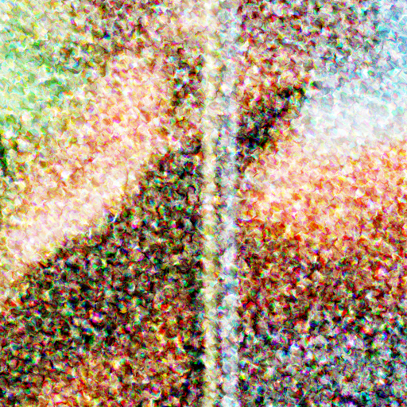
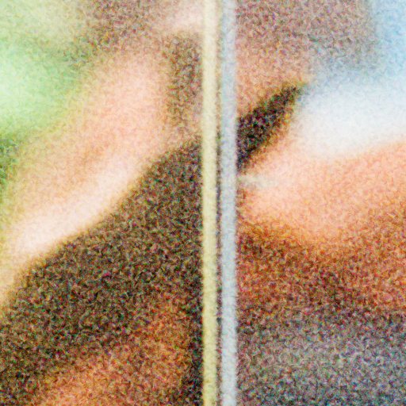

# larm
larm is a film grain/noise generator written in Rust and delivered as a browser-only WebAssembly app.


# Building from source
larm is now a browser-only app. The grain engine is compiled from Rust to WebAssembly and the UI is served as static files.

Requirements:

- Rust with the `wasm32-unknown-unknown` target available
- Node.js
- Python 3 for the local static file server

If you use `rustup`, install the target with:

```bash
rustup target add wasm32-unknown-unknown
```

Build and run:

```bash
git clone git@github.com:eilifhl/larm.git
cd larm
npm run build
npm run dev
```

The UI will then be available at `http://localhost:8080`.

You can also use:

```bash
make run
```

# Examples


### Cropped


--- 


### Cropped

